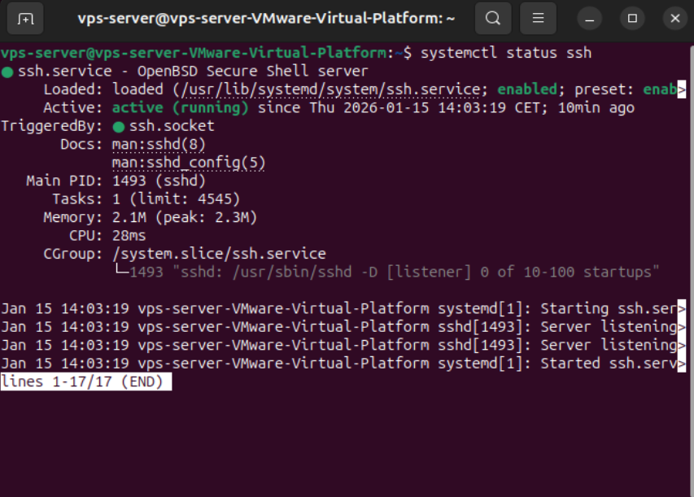
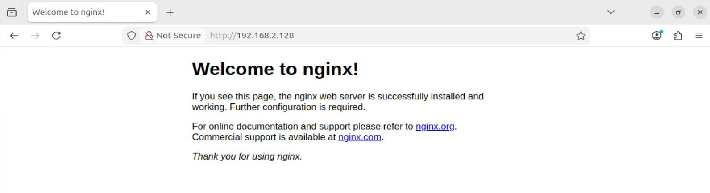

1. Initial Installation – Unhardened Baseline
1.1 Purpose of This Phase

The purpose of this phase is to establish a realistic, intentionally un-hardened baseline environment.
This baseline serves as the reference point for subsequent security assessments, hardening actions, and before/after comparisons.

At this stage, the environment is configured to reflect a common initial deployment scenario, where basic services are installed to provide accessibility and exposure, but no security hardening measures have yet been applied.

This phase is not intended to demonstrate best practices, but to establish a controlled and well-documented starting point for security analysis.

1.2 Environment Overview

The system is deployed as a locally hosted virtual machine designed to replicate a production-like Virtual Private Server (VPS).

Operating system: Linux (Ubuntu/Debian-based server distribution)

Deployment type: Virtual machine (production-like VPS simulation)

Exposure: Network-accessible services enabled

Security posture: Intentionally un-hardened

The environment is isolated from third-party systems and used exclusively for this project.

1.3 Operating System Installation

A minimal server installation of the operating system was performed.

Default installation options were used

No custom partitioning or security profiles were applied

A standard user account was created during installation

Remote access was enabled to allow administration via SSH

No additional security configurations were applied during or immediately after installation.

1.4 Installed Services and Tools

After the operating system installation, only essential services and tools required to expose the system were installed.

Secure Shell (SSH)

SSH was installed and enabled to allow remote administration

Default configuration was retained

Standard port usage was preserved

Password-based authentication was permitted

No access restrictions or brute-force protections were applied

This configuration reflects a common initial deployment state prior to hardening.

Web Server (Nginx)

A default installation of Nginx was deployed

The default site configuration was used

The service was exposed over HTTP

At this stage:

TLS/HTTPS was not configured

No security headers were applied

No attempts were made to reduce server fingerprinting

The web server is intentionally left in its default configuration to provide a realistic attack surface for baseline assessment.

Only minimal administrative tools required for basic system access were installed during this phase.

No additional security or monitoring tools were installed during this phase.

1.5 System Update Status

At this stage, no system-wide package updates were applied.

apt update and apt upgrade were intentionally not executed

The system remains in a near-default post-installation state

This decision was made to preserve an authentic baseline environment and to allow the impact of system updates and security patches to be evaluated explicitly during the hardening phase.

1.6 Network Exposure and Security Controls

During this phase:

No firewall rules were configured

No network filtering or access control was applied

All installed services were reachable according to default behavior

The absence of security controls is intentional and reflects a realistic initial exposure commonly found in newly deployed systems.

1.7 Baseline State Summary

At the conclusion of this phase, the system can be summarized as follows:

A Linux server deployed in a production-like virtual environment

SSH and HTTP services exposed using default configurations

No system updates, hardening, or access restrictions applied

No firewall, intrusion detection, or monitoring mechanisms enabled

This environment serves as the baseline for the security assessments conducted in the next phase.