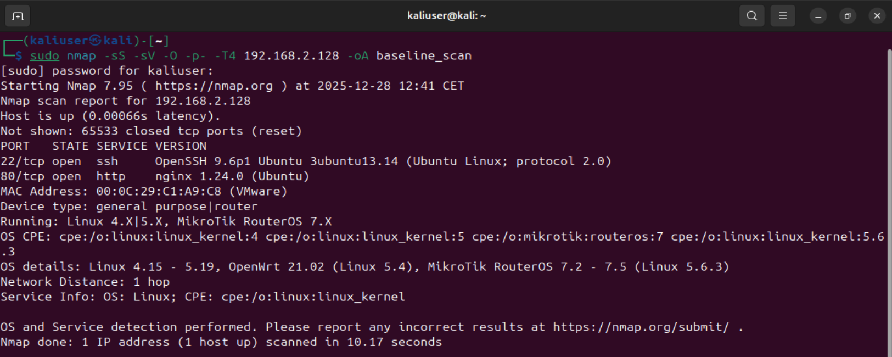
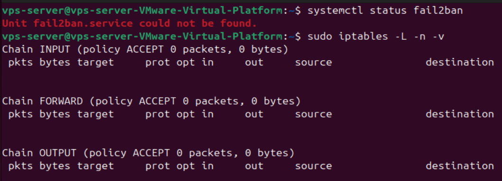
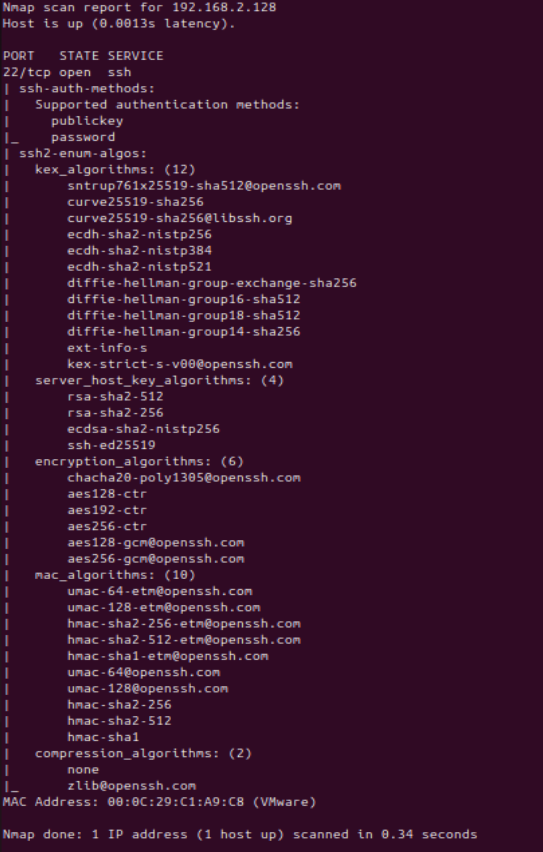
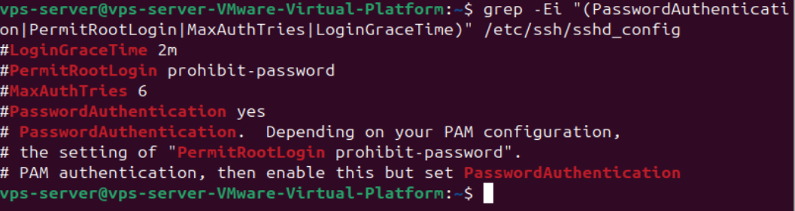
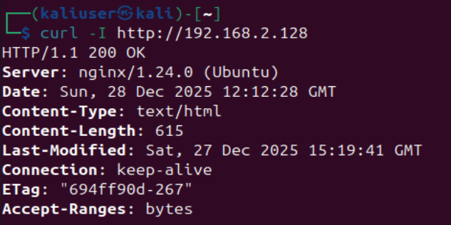
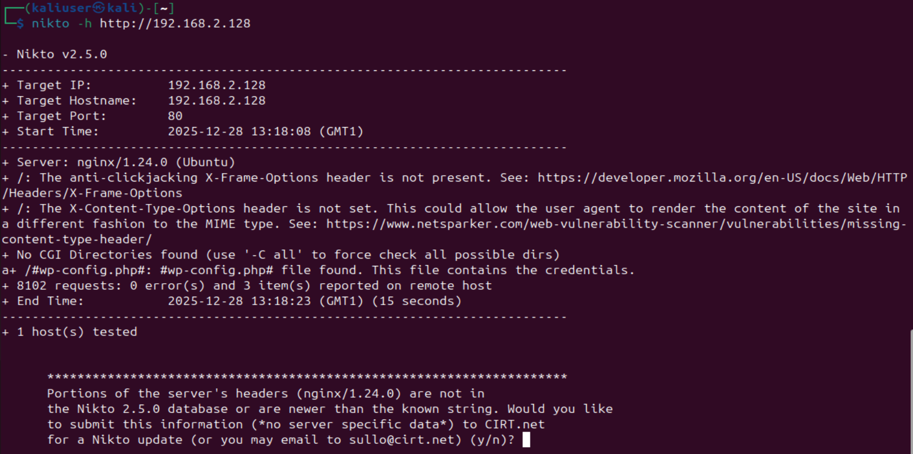
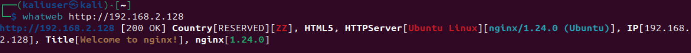
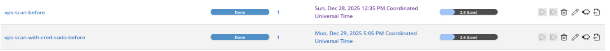
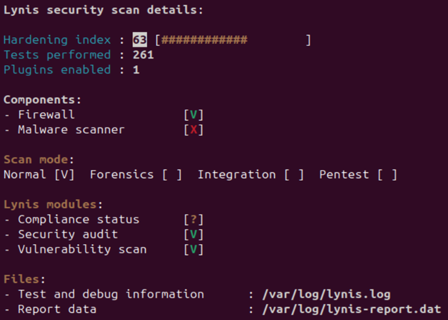

2. Baseline Penetration Testing (Unhardened State)
2.1 Purpose of the Baseline Assessment

The purpose of this phase is to assess the security posture of the system in its initial, intentionally un-hardened state.
The assessment establishes a baseline against which the effectiveness of subsequent hardening measures can be measured.

The testing focuses on identifying exposed services, insecure default configurations, and realistic attack opportunities rather than exploit development or destructive testing.

All activities were conducted within the defined project scope and against systems owned and operated as part of the project.

The assessment primarily assumes an external, non-authenticated attacker with network access to the system. In addition, system-level hardening controls were evaluated to assess the impact and feasibility of post-exploitation activity in the event of an initial compromise.

2.2 Methodology Overview

The baseline assessment combines:

External network-based reconnaissance

Service and protocol analysis

Manual configuration review

Automated vulnerability scanning

Host-based security auditing

Automated tools were used to support discovery, while manual analysis was applied to interpret real-world risk and attack feasibility.

2.3 Network and Service Discovery
Tool Used

Nmap

Purpose

To identify exposed ports, services, and operating system characteristics.

Command Used
sudo nmap -sS -sV -O -p- <target-ip>

Summary of Findings

Multiple TCP ports were accessible externally

SSH (port 22) and HTTP (port 80) were exposed

Service version detection confirmed default service configurations

The system fingerprinted as a Linux-based server

This confirmed a realistic initial attack surface suitable for further analysis.

2.4 SSH Security Assessment
Tools Used

Nmap NSE scripts

Manual configuration inspection

Commands Used
sudo nmap --script ssh-auth-methods,ssh2-enum-algos -p 22 <target-ip>

grep -Ei "(PasswordAuthentication|MaxAuthTries|LoginGraceTime)" /etc/ssh/sshd_config

Findings

Password-based authentication was enabled

Default SSH configuration was in use

No brute-force protection mechanisms were present

No compensating controls such as rate limiting or intrusion prevention were detected

Risk Interpretation

Password-based authentication significantly increases the likelihood of credential-based attacks, especially when no intrusion prevention mechanisms are present.
While no software vulnerabilities were identified, the configuration itself presents a realistic and commonly exploited attack path.

2.5 Web Server and HTTP Analysis
Tools Used

curl

Nmap NSE scripts

Nikto

WhatWeb

Commands Used
curl -I http://<target-ip>

sudo nmap -p 80 --script http-enum,http-headers,http-methods,http-security-headers <target-ip>

nikto -h http://<target-ip>

whatweb http://<target-ip>

Findings

The web server was accessible over HTTP

No TLS/HTTPS configuration was present

No HTTP security headers were configured

Default Nginx configuration was in use

Fingerprinting confirmed Nginx running on Ubuntu

No CMS or application-specific logic was detected

Risk Interpretation

The absence of basic security headers and transport encryption increases exposure to client-side and man-in-the-middle attack scenarios.
The findings reflect a typical default deployment rather than misconfiguration or software flaws.

2.6 Automated Vulnerability Scanning
Tool Used

Greenbone Vulnerability Management (OpenVAS)

Purpose

To identify known vulnerabilities and misconfigurations using an industry-standard vulnerability scanner.

Scan Type

Full unauthenticated scan

Network-based assessment

Summary of Results

No critical exploitable CVEs were identified

Several informational and low-to-medium risk findings were reported

Findings primarily related to service exposure and configuration state

Interpretation

Additional Scan Context

Both an unauthenticated network-based scan and an authenticated scan with elevated (sudo) privileges were performed. The authenticated scan did not reveal any additional critical or high-risk vulnerabilities compared to the unauthenticated scan. Both scans produced comparable results, indicating that the system does not suffer from known exploitable vulnerabilities detectable through credentialed assessment.

This outcome suggests that the primary security risks are not related to missing patches or vulnerable software versions, but instead stem from insecure default configurations, exposed services, and the absence of preventive and detective security controls.

The absence of critical CVEs does not indicate a secure system.
Automated vulnerability scanners primarily detect known vulnerabilities, whereas configuration weaknesses and attack feasibility often require manual analysis.

This result reinforces the importance of combining automated scanning with human-driven assessment.

2.7 Host-Based Security Audit
Tool Used

Lynis

Scan Mode

Normal system audit mode

Rationale

Lynis was used to perform a host-based security audit focusing on system configuration, hardening level, and defense-in-depth controls.

The same scan mode is used before and after hardening to ensure comparability.

Result

Lynis Hardening Index: 63

Primary Findings

The following findings were selected as representative and relevant to the project scope:

No firewall rules configured (High)

No brute-force protection mechanisms (High)

SSH default configuration / insufficient hardening (High)

Lack of monitoring and auditing mechanisms (Medium–High)

Web server exposed without HTTPS (Medium)

Additional System-Level Findings Identified Through Hardening Analysis

In addition to the primary findings identified through network-based and service-focused penetration testing, a host-based security audit using Lynis revealed several system-level weaknesses related to hardening, defense-in-depth, and post-exploitation resistance.
These findings were not directly observable through external testing but are relevant to the overall security posture of the system.

Finding A – Lack of Bootloader Protection (GRUB)

Description
The system bootloader (GRUB) is not protected by a password, allowing unrestricted access to boot-time configuration options.

Impact
An attacker with physical access or virtual console access could modify kernel boot parameters, boot into single-user mode, or otherwise bypass authentication mechanisms. This could result in full system compromise.

Evidence
Lynis check: Checking for password protection [NONE]
Manual verification:
grep password /etc/grub.d/*

Severity
Medium
(High if physical or console access is included in the threat model)

Finding B – Weak System Identification Banners

Description
System identification banners located in /etc/issue and /etc/issue.net contain default or weak information that may disclose operating system details.

Impact
Informative banners facilitate reconnaissance and fingerprinting, enabling attackers to tailor attacks more efficiently. Such information is commonly leveraged during automated scanning and early attack phases.

Evidence
Lynis findings:
/etc/issue contents [WEAK]
/etc/issue.net contents [WEAK]
Manual verification:
cat /etc/issue
cat /etc/issue.net

Severity
Low–Medium

Finding C – AppArmor Enabled but Largely Unenforced

Description
Although AppArmor is enabled on the system, a significant number of processes are running without confinement profiles.

Impact
Unconfined processes reduce the effectiveness of mandatory access controls. In the event of a service compromise, an attacker would face minimal containment, enabling lateral movement and post-exploitation activity.

Evidence
Lynis finding: Found 117 unconfined processes
Manual verification:
aa-status

Severity
Medium

Finding D – Excessive Enabled System Services Increasing Attack Surface

Description
A large number of system services are enabled by default, several of which are marked as exposed or unsafe by Lynis.

Impact
An unnecessarily large attack surface increases both the likelihood of exploitation and the maintenance burden of the system. Services running with default configurations may introduce future vulnerabilities if not actively managed.

Evidence
Lynis finding: found 59 enabled services
Manual verification:
systemctl list-unit-files --state=enabled

Severity
Medium

Finding E – Kernel Hardening Deviations from Secure Baseline

Description
Multiple kernel parameters deviate from hardened baseline values, indicating reliance on default kernel settings.

Impact
Default kernel configurations prioritize compatibility over security. Deviations may lead to increased risk of information leakage, weaker protection against local privilege escalation, and reduced defense-in-depth.

Evidence
Lynis reference: Multiple sysctl values differ from scan profile [KRNL-6000]
Manual verification:
sysctl -a | grep -E "kptr_restrict|dmesg_restrict|perf_event"

Severity
Medium

Contextual Interpretation

These findings complement the primary penetration testing results by highlighting systemic weaknesses that affect resilience after initial compromise. While they do not represent immediate externally exploitable vulnerabilities, they significantly influence post-exploitation impact, attack persistence, and overall security maturity.

2.8 Summary of Key Security Findings

The baseline assessment identified multiple security weaknesses related to configuration, exposure, and lack of defensive controls:

SSH exposed with password authentication and no intrusion prevention

Web server exposed using default configuration over HTTP

Absence of firewalling and monitoring

Limited defense-in-depth mechanisms

Reliance on default system settings prioritizing usability over security

While no single issue resulted in immediate compromise, the combination of weaknesses presents realistic attack scenarios when chained together.

2.9 Limitations

No exploit-based attacks were performed

No denial-of-service testing was conducted

The assessment represents a snapshot of the system in its initial state

Testing was limited to non-intrusive techniques

2.10 Transition to Hardening Phase

The findings from this baseline assessment form the basis for the hardening measures implemented in the next phase.
Each hardening action directly addresses one or more identified weaknesses, enabling measurable before-and-after comparison.