3. Server Hardening

The hardening measures applied in this phase are based on a realistic threat model
for a public-facing Linux server. The primary threat vectors considered include
remote network-based attacks, credential abuse, service exploitation, and
post-exploitation lateral movement.

Physical access to the server is considered out of scope, except where mitigated
through bootloader protection and virtualization controls.

Certain advanced hardening techniques, such as custom AppArmor profiles and
aggressive systemd service sandboxing, were intentionally not implemented. These
controls require extensive testing and carry a higher risk of service disruption
when applied without application-specific knowledge.

Instead, a layered defense strategy was adopted, prioritizing stability, attack
surface reduction, and compensating controls appropriate for a production
environment.

System Update

Prior to applying additional hardening controls, the system was updated to ensure
that all installed packages and dependencies were running the latest available
security patches. This reduces exposure to known vulnerabilities and ensures that
subsequent security mechanisms operate on a fully patched baseline.

3.1 SSH Hardening

A system snapshot was taken prior to SSH hardening to ensure recoverability in the
event of misconfiguration or administrative lockout.

During the baseline assessment, it was identified that SSH access relied solely on
password-based authentication. No SSH public keys were present on the system,
indicating that key-based authentication had not been configured.

To prevent accidental lockout during subsequent SSH hardening steps, key-based
authentication was configured and verified prior to modifying the SSH service
configuration.

An ED25519 SSH key pair was generated on the administrator workstation. The private
key was stored locally in the default SSH directory and protected using a strong
passphrase to reduce the risk of key compromise on the local system. The
corresponding public key was securely deployed to the server.

Key-based authentication was verified by successfully establishing a new SSH
session without the use of a server password. Only after successful verification
was the system considered safe for further SSH configuration hardening.

Password-based authentication was verified to be disabled by explicitly preventing public key usage during testing, resulting in rejected login attempts. 

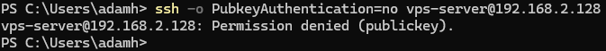

Additional SSH hardening measures were applied by disabling root login over SSH and
restricting authentication behavior through reduced authentication attempts and
login grace time. These controls further limit brute-force feasibility and reduce
exposure in the event of automated attack attempts.

SSH was hardened to a secure baseline appropriate for a public-facing Linux server, prioritizing risk reduction, operational safety, and verifiability rather than exhaustive configuration.

3.3 Firewall Hardening (UFW)

A system snapshot was taken prior to firewall hardening to ensure recoverability
in the event of misconfiguration or loss of remote access.

During the baseline assessment, the system was found to lack any host-based firewall
controls. No inbound traffic restrictions were enforced, resulting in unnecessary
exposure of network services.

To reduce the external attack surface, a host-based firewall was implemented using
UFW. The default policy was configured to deny all incoming traffic while allowing
outgoing connections to ensure normal system operation, updates, and external
communication.

Only explicitly required services were permitted through the firewall. SSH access
was allowed to support secure remote administration, while HTTP and HTTPS were
permitted to enable web access and support subsequent TLS certificate deployment.

The firewall configuration was verified to be active and enforcing the defined
policy. The active ruleset confirms that all non-essential inbound traffic is
blocked while required services remain accessible.

The active firewall configuration is shown in Figure:

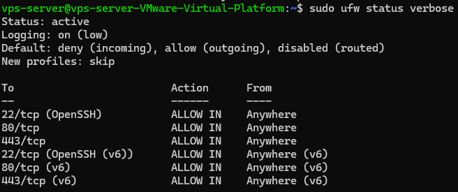

3.4 Inrustion Prevention (Fail2Ban)

An intrusion prevention mechanism was implemented using Fail2Ban to provide dynamic
protection against brute-force and automated attack attempts. Fail2Ban monitors
authentication logs and automatically blocks offending IP addresses through the
host-based firewall when predefined thresholds are exceeded.

SSH protection was enabled with conservative retry limits to balance security and
operational usability. The Fail2Ban service was verified to be active and enforcing
the configured policy.

This adds a dynamic layer of defense that complements static firewall rules by
responding to active attack behavior in real time.

The active SSH jail status is shown in Figure:

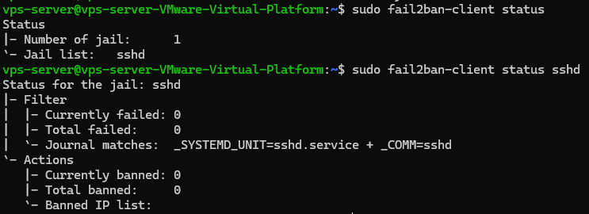

3.5 Operating System and Kernel Hardening

Operating system and kernel-level hardening measures were applied to reduce the
impact of post-exploitation activity and limit information disclosure. These
controls focus on strengthening system behavior beyond perimeter defenses and
address several weaknesses identified during the baseline system audit.

System identification banners were modified to remove default operating system
information, reducing the effectiveness of fingerprinting during reconnaissance.

The applied operating system fingerprint hardening measures are shown in Figure:

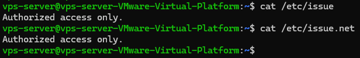

Kernel parameters were hardened using sysctl to restrict access to kernel pointers,
limit diagnostic information exposure, and reduce the risk of local information
leakage and privilege escalation. Additional network-related kernel settings were
applied to improve resilience against spoofing and misrouting attacks.

All changes were applied using persistent configuration files and verified to be
active at runtime.

The applied kernel hardening parameters are shown in Figure:

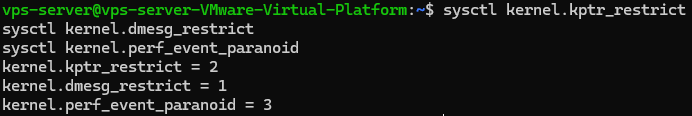

3.6 Web Server Hardening

Web server hardening measures were applied to protect client communication, reduce
client-side attack vectors, and limit service fingerprinting.

Due to the environment running on a local virtual machine without a public IP
address, HTTPS was configured using a self-signed TLS certificate. This approach
mirrors a production HTTPS configuration while acknowledging lab environment
constraints.

All HTTP traffic was redirected to HTTPS to ensure that unencrypted access is not
permitted. Transport Layer Security (TLS) was enforced to protect data in transit
and mitigate man-in-the-middle attack scenarios.

Additional HTTP security headers were configured to reduce exposure to common
client-side attacks, including clickjacking, MIME-type sniffing, and reflected
cross-site scripting.

Service fingerprinting was further reduced by limiting server version disclosure.
All changes were applied using persistent configuration files and verified through
direct header inspection.

The enforced HTTPS configuration, HTTP-to-HTTPS redirection, applied security
headers, and reduced service fingerprinting are shown in the accompanying figures.

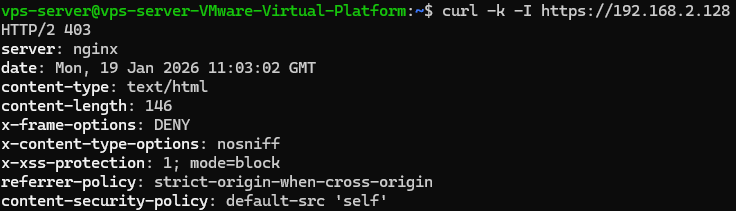

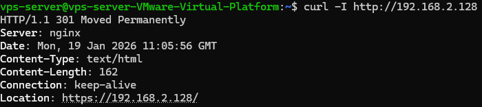

3.7 AppArmor

Application-level mandatory access controls were evaluated and strengthened using
AppArmor to improve post-exploitation containment and defense-in-depth.

During the baseline assessment, AppArmor was found to be enabled at the kernel level
but largely unenforced, with a significant number of processes running without
confinement. This limits the effectiveness of mandatory access control and increases
the potential impact of a successful service compromise.

As part of the hardening process, additional AppArmor profile packages were installed
to expand available confinement coverage. This resulted in an increased number of
loaded and enforced profiles, improving overall policy coverage for system and
service processes.

It was confirmed that default AppArmor profiles for certain core services, such as
SSH and Nginx, were not available on the target Ubuntu distribution. Rather than
deploying custom profiles, this limitation was documented and compensated for
through layered security controls, including strict service hardening, firewalling,
intrusion prevention, and attack surface reduction.

The AppArmor enforcement state was verified after profile installation, confirming
that mandatory access control is active and enforced where supported.

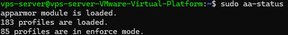

3.8 Service Reduction

A service reduction review was conducted to minimize unnecessary attack surface by
disabling services not required for a production server environment.

The baseline system configuration included multiple services intended for desktop or
end-user use cases, such as printing, service discovery, wireless management, and
telemetry components. These services increase attack surface without providing value
in a server context.

Non-essential services were selectively disabled to reduce background functionality
and limit potential exposure. Care was taken to preserve all services required for
core system operation, remote administration, networking, logging, and security
controls.

This approach reduces attack surface while maintaining system stability and
operational integrity. All remaining enabled services were reviewed and confirmed to
align with the server’s intended role and security requirements.

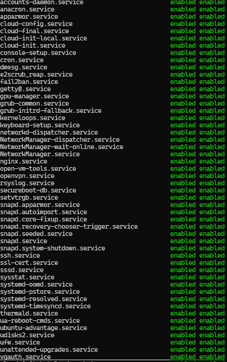

3.9 Bootloader Protection

Bootloader protection was implemented to mitigate risks associated with physical or
virtual console access. The system bootloader (GRUB) was configured with password
protection to prevent unauthorized modification of boot parameters and access to
single-user mode.

This control reduces the risk of local privilege escalation and unauthorized system
manipulation in the event of console-level access. Bootloader hardening complements
other system-level security controls by limiting attack opportunities prior to
operating system initialization.

3.10 Audit Logging (auditd)

Audit logging was implemented using auditd to provide detailed visibility into
security-relevant system activity and to support incident detection, forensic
analysis, and accountability.

The purpose of auditd is not to prevent attacks, but to ensure that critical system
events can be traced and analyzed in the event of suspected compromise, misuse of
privileges, or policy violations. This capability is considered essential in
production environments where post-incident investigation and forensic analysis
may be required.

A conservative audit policy was applied, focusing on high-value events with clear
security relevance. These include authentication-related files, privilege
escalation mechanisms, SSH configuration, and core system binaries. The ruleset was
intentionally limited to avoid excessive log volume, minimize performance impact,
and reduce operational complexity.

All audit rules were applied using persistent configuration files to ensure they
remain active across reboots. The audit subsystem was verified to be enabled at the
kernel level, and the auditd service was confirmed to be running and enforcing the
configured ruleset at runtime.

This implementation provides meaningful traceability and enterprise-relevant
logging while maintaining system stability and operational safety.

Audit Scope and Design Considerations

The audit configuration was designed according to the following principles:

Focus on events with clear security and forensic value

Avoid syscall-level or overly verbose auditing

Prioritize stability and predictable system behavior

Ensure audit coverage for identity, access control, and system integrity

Aggressive audit policies, such as full syscall auditing or STIG-level rule sets,
were intentionally not implemented, as they significantly increase log volume and
operational risk without proportional security benefit in this environment.

Verification and Validation

The audit subsystem was validated through the following steps:

Confirmation that auditd is enabled and running

Verification that audit rules are actively loaded

Functional testing by performing controlled file operations and confirming that
corresponding audit events are recorded

This ensures that audit logging is both operational and effective, rather than
merely installed.

The validation results are shown in the following figures:

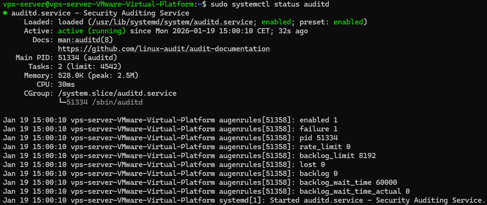

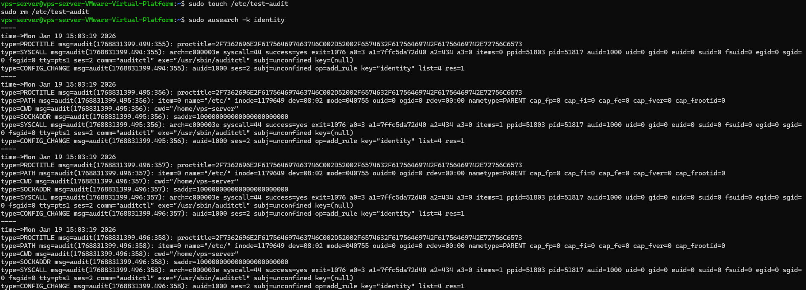

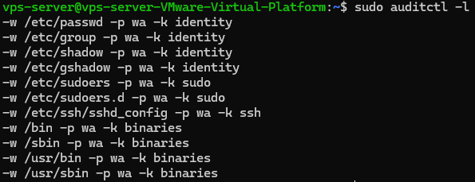

3.11 File Integrity Monitoring (AIDE)

File integrity monitoring was implemented using AIDE to detect unauthorized or
unexpected changes to critical system files.

AIDE creates a cryptographic baseline of selected system paths and compares the
current state against this baseline during integrity checks. This enables detection
of file tampering or post-exploitation persistence mechanisms.

The default Ubuntu AIDE configuration was retained to minimize operational risk and
ensure system stability while providing coverage for high-value system locations,
including core binaries and configuration files.

The initial integrity database was generated after system hardening was completed
and verified through controlled integrity checks.

This control provides an additional detective security layer that complements audit
logging and intrusion prevention mechanisms.

Verification and Validation

The AIDE implementation was verified by successfully generating the initial database
and executing integrity checks with expected results.

3.12 Malware Scanning (ClamAV)

A basic malware scanning capability was implemented using ClamAV to provide an
additional layer of defense against known malicious files.

The scanner was configured with up-to-date signatures and verified to be operational.
A controlled on-demand scan of core system directories was performed, focusing on
system binaries and executables.

No malware was detected during the scan. This control is intended as a supplementary
security measure and does not replace other preventive or detective mechanisms.

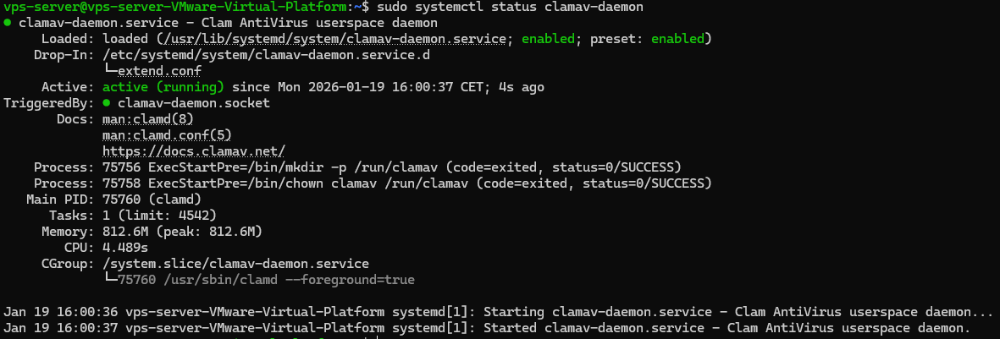

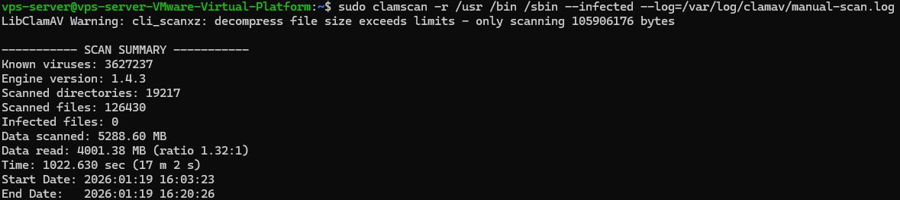

3.13 Accepted Risk and Compensating Controls

Several identified findings and tool-reported suggestions were intentionally
accepted based on risk assessment, environmental context, and operational
considerations. These include the absence of custom AppArmor profiles for certain
services and limited systemd service sandboxing. These decisions were documented
and compensated through layered security controls.

The applied hardening measures collectively implement a defense-in-depth strategy,
combining preventive, detective, and containment-focused controls. No single control
is relied upon to provide complete security; instead, multiple layers reduce attack
likelihood, limit impact, and improve resilience in the event of compromise.

3.14 Automatic Security Updates (Unattended Upgrades)

To reduce long-term attack surface and ensure timely patching of known vulnerabilities, automatic security updates were enabled on the VPS using Ubuntu’s unattended-upgrades mechanism.

The configuration is limited strictly to security updates, avoiding feature or distribution upgrades to preserve system stability. This ensures that critical vulnerabilities are patched without introducing unexpected behavior or downtime.

Automatic updates run periodically via systemd timers and apply only packages from trusted security repositories. Automatic reboots are explicitly disabled, as availability and controlled maintenance windows are prioritized.

This measure strengthens the baseline security posture of the system by minimizing the risk of exploitation caused by outdated packages. It serves as a preventive hardening control, complementing later detection and response mechanisms such as logging, monitoring, IDS/IPS, and SOAR automation.

3.15 Hardening Automation and Reproducibility

All hardening measures described in this phase were implemented through a fully scripted and configuration-driven approach. Each control was applied using dedicated hardening scripts that reference version-controlled configuration files, ensuring consistent, repeatable, and auditable application across systems.

No manual configuration changes were performed directly on the target system. Instead, every modification to system services, kernel parameters, authentication mechanisms, logging, and security tooling was applied through automation. This approach reduces human error, ensures predictable outcomes, and enables rapid reapplication of the hardening baseline to new or rebuilt servers.

The hardening scripts are designed to be idempotent and can be safely re-executed without causing configuration drift or unintended side effects. This design choice enables the hardening baseline to function not only as a one-time setup process, but also as a continuously enforceable security standard.

By implementing hardening controls as code, the system’s security posture becomes reproducible, reviewable, and easily transferable to other environments. This automation-first approach directly enables the next phase of the project, which focuses on backup, recovery, and restoration.