4. Post-Hardening Penetration Testing (Verification Phase)

A snapshot was taken after completion and verification of all hardening measures
to preserve a stable and reproducible baseline prior to security testing.

4.1 Purpose of the Post-Hardening Assessment

The purpose of this phase is to validate the effectiveness of the implemented hardening measures and to identify any remaining or newly introduced security weaknesses following system configuration changes.

This assessment verifies that previously identified information disclosure vectors and insecure defaults have been successfully mitigated and that no unintended exposures were introduced as a result of the hardening process.

The post-hardening testing is intended to measure improvement relative to the established baseline and to confirm that the system now operates within an acceptable risk profile.

All activities were conducted within the defined project scope and against systems owned and operated as part of the project.

The assessment assumes the same external, non-authenticated attacker model as the baseline phase to ensure a consistent and comparable evaluation. No destructive testing or exploit development was performed during this phase.

4.2 Methodology Overview

The post-hardening assessment combines:

External network-based reconnaissance to validate reduced attack surface and service exposure

Service and protocol verification to confirm removal of identifying metadata and insecure defaults

Comparative analysis against baseline findings to measure hardening effectiveness

Manual validation of hardened configurations and response behavior

Targeted re-scanning to identify any residual or newly introduced information disclosure vectors

4.3 Network and Service Discovery

Tool Used

Nmap

Purpose

To identify exposed ports, services, and operating system characteristics.

Command Used
sudo nmap -sS -sV -O -p- <target-ip>

systemctl status fail2ban

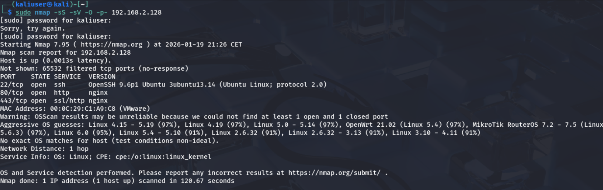

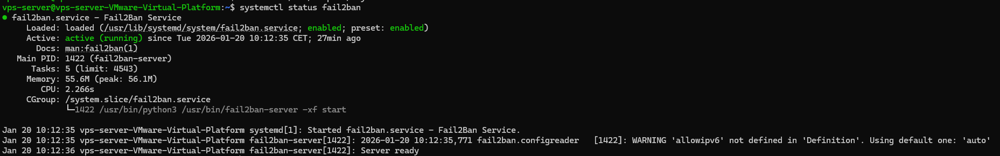

Summary of Findings

The SSH service disclosed detailed implementation and distribution-specific information, including exact OpenSSH version and underlying Linux distribution, enabling precise service fingerprinting and targeted vulnerability mapping.

The web server handling both HTTP and HTTPS traffic was identified as nginx, exposing the underlying server technology to active service probing.

Aggressive OS detection techniques successfully inferred the operating system as Linux with a relatively narrow kernel version range, significantly reducing uncertainty for attackers during reconnaissance.

The network interface MAC address revealed a VMware Organizationally Unique Identifier (OUI), disclosing that the system was running in a virtualized environment.

Standardized operating system enumeration was possible through the presence of a Linux kernel Common Platform Enumeration (CPE), facilitating automated vulnerability correlation.

Network topology information indicated a network distance of one hop, suggesting local or directly adjacent network placement.

Collectively, these disclosures provided multiple layers of environmental and platform intelligence that could be leveraged to improve the efficiency and accuracy of attack planning.

While these disclosures do not represent direct exploitation paths, they may assist
an attacker during reconnaissance and were therefore addressed as part of
validation-driven refinements.

Remediation actions to eliminate the identified security findings

Reduced SSH service identification by removing distribution-specific banners and non-essential version information while preserving protocol compatibility.

Hardened the web server configuration by removing all HTTP and HTTPS server identification headers, including redirect responses, to prevent explicit web server fingerprinting.

Degraded operating system fingerprinting accuracy by filtering non-standard TCP probes and rate-limiting ICMP responses used for network stack analysis.

Eliminated virtualization disclosure by spoofing the network interface MAC address using a locally administered address.

Removed standardized platform enumeration artifacts as a direct result of reduced service and OS fingerprinting.

Preserved full system functionality and availability while applying all hardening measures.

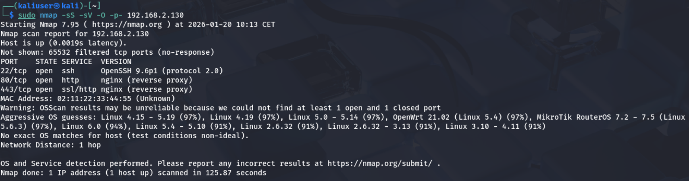

4.4 SSH Security Assessment
Tools Used

Nmap NSE scripts

Manual configuration inspection

Commands Used
sudo nmap --script ssh-auth-methods,ssh2-enum-algos -p 22 <target-ip>

grep -Ei "(PasswordAuthentication|MaxAuthTries|LoginGraceTime)" /etc/ssh/sshd_config

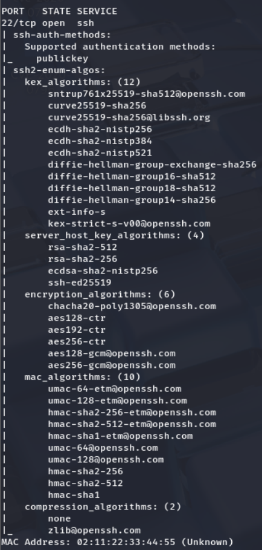

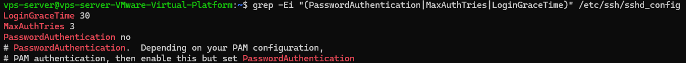

Findings

Legacy SSH Cryptographic Options

The SSH service supported legacy message authentication algorithms, including hmac-sha1, which are no longer considered best practice and may increase the risk of cryptographic downgrade.

The SSH service allowed optional compression (zlib@openssh.com), which is unnecessary in most environments and has historically been associated with side-channel risks.

Remediation actions to eliminate the identified security findings

Removed legacy SSH cryptographic options, including weak message authentication codes and unnecessary compression support, to further reduce downgrade and cryptographic attack surface identified during verification.

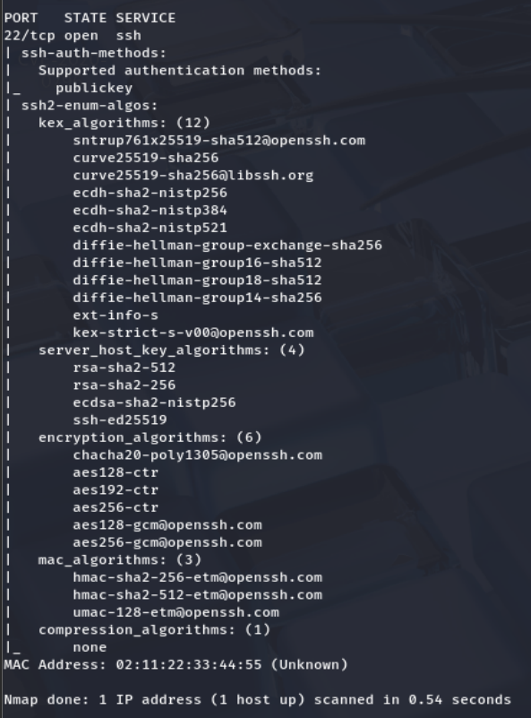

Observed results:

Compared to the baseline assessment, SSH authentication has been significantly hardened. Password-based authentication is now fully disabled, limiting access to key-based authentication only. Authentication attempts are restricted, and the unauthenticated session window has been reduced.

In addition, legacy cryptographic options previously exposed during enumeration have been removed, and the SSH service now presents a reduced and more secure attack surface. No brute-force–viable authentication paths were observed during re-testing.

4.5 Web Server and HTTP Analysis
Tools Used

curl

Nmap NSE scripts

Nikto

WhatWeb

Commands Used
curl -I http://<target-ip>

sudo nmap -p 80 --script http-enum,http-headers,http-methods,http-security-headers <target-ip>

nikto -h http://<target-ip>

whatweb http://<target-ip>

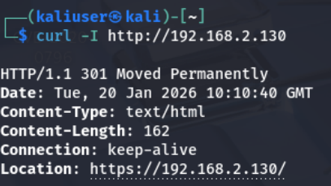

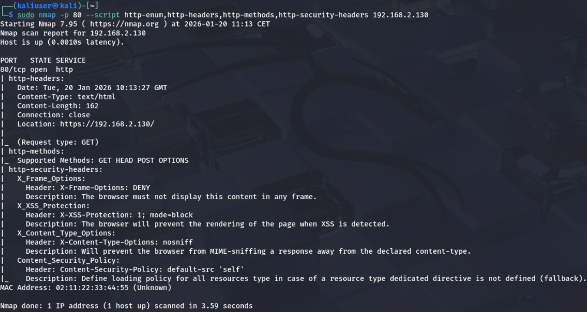

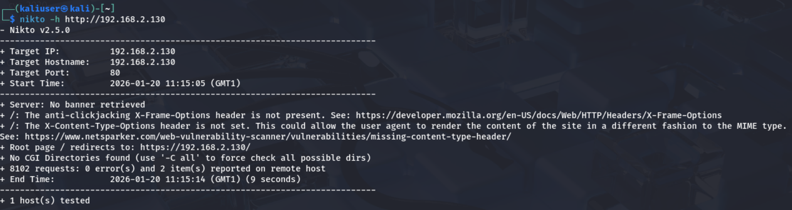

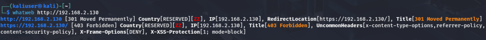

Findings

The only observation during post-hardening verification was that HTTP security
headers are not present on the HTTP redirect response. No exploitable
vulnerabilities were identified.

Remediation actions to eliminate the identified security findings

Security headers were explicitly added to HTTPS responses and HTTP behavior
was restricted to redirection only.

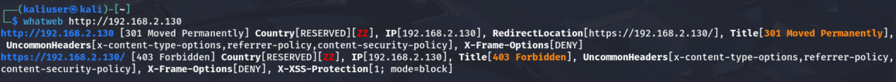

Observed Results

Compared to the baseline assessment, unsecured HTTP access, missing security
headers, and server fingerprinting issues are no longer present.

4.6 Automated Vulnerability Scanning
Tool Used

Greenbone Vulnerability Management (OpenVAS)

Purpose

To identify known vulnerabilities and misconfigurations using an industry-standard vulnerability scanner.

Scan Type

Full unauthenticated scan

Network-based assessment

Summary of Results

No critical exploitable CVEs were identified

Several informational and low-to-medium risk findings were reported

Findings primarily related to service exposure and configuration state

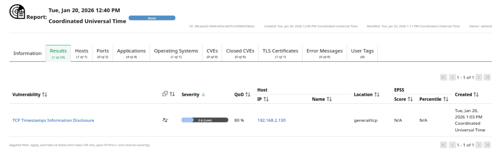

Findings

TCP Timestamps Information Disclosure
Severity: Low / Informational

The automated vulnerability scan identified that the target system responds with TCP timestamps. This behavior may allow limited information disclosure related to system uptime and can marginally assist operating system fingerprinting techniques.

No associated CVE or direct exploitation path was identified. The finding represents a low-impact, protocol-level information exposure.

Remediation Actions to Eliminate the Identified Security Findings

TCP timestamps were disabled at the operating system level to eliminate residual protocol-level information disclosure and further reduce passive fingerprinting opportunities.

This change was applied as a defense-in-depth hardening measure and does not impact system functionality or network stability.

Observed Results (Post-Hardening Verification)

Following remediation, automated vulnerability scanning no longer reported TCP timestamp information disclosure. No additional vulnerabilities or informational findings were identified during re-testing.

Compared to earlier assessments, the system now exposes no detectable protocol-level or service-level information disclosures through automated scanning.

4.7 Host-Based Security Audit
Tool Used

Lynis

Scan Mode

Normal system audit mode

Rationale

Lynis was used to perform a host-based security audit focusing on system configuration, hardening level, and defense-in-depth controls.

The same scan mode is used before and after hardening to ensure comparability.

Result

Lynis Hardening Index (pre-remediation): 74
Baseline Hardening Index: 63

Findings

The host-based security audit identified several remaining configuration weaknesses that were consistent with findings observed during the baseline assessment. These findings primarily relate to informational disclosure and defense-in-depth controls rather than conditions enabling immediate external compromise.

No new categories of findings were introduced during this assessment.

Finding A – Weak System Identification Banners

Description
System identification banners located in /etc/issue and /etc/issue.net contained default or weak information that disclosed operating system details.

Impact
These banners may assist local or post-compromise reconnaissance by revealing platform information. While not externally exploitable, such disclosures provide unnecessary contextual information to an attacker.

Severity
Low

Finding B – AppArmor Enabled but Largely Unenforced

Description
AppArmor was enabled on the system; however, a large number of processes were running without confinement profiles.

Impact
Unconfined processes reduce containment capabilities in the event of a successful compromise. This primarily affects post-exploitation impact rather than initial access.

Severity
Medium

Finding C – Enabled System Services Increasing Attack Surface

Description
A moderate number of system services remained enabled and running by default.

Impact
While no unnecessary externally exposed services were identified, enabled services increase system complexity and potential attack surface. This finding reflects a balance between security hardening and operational requirements.

Severity
Medium

Finding D – Kernel Hardening Deviations from Secure Baseline

Description
Several kernel parameters were configured with default values rather than hardened baseline recommendations.

Impact
Default kernel settings prioritize compatibility and may weaken defense-in-depth protections against local attacks or post-exploitation activity.

Severity
Medium

Remediation Actions

Following identification of the above findings, targeted low-risk remediation actions were applied to improve system hardening without impacting availability or administrative access.

The following changes were implemented:

System identification banners in /etc/issue and /etc/issue.net were sanitized to remove operating system disclosure.

A restrictive default umask was configured to reduce the risk of overly permissive file creation.

Network-related kernel parameters were hardened to improve logging of suspicious traffic and disable unnecessary redirect behavior.

SSH logging verbosity was increased to enhance auditability and detection capabilities.

As a result of these remediation actions, the Lynis hardening index increased to 75.

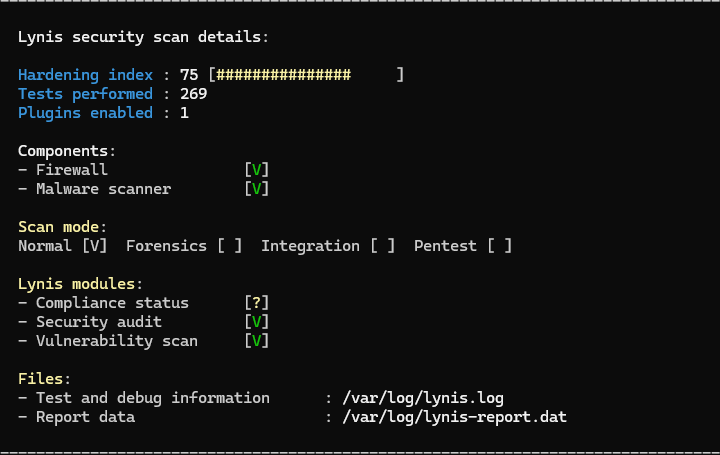

Observed Results (Comparison with Baseline and Pre-Remediation State)

The baseline Lynis hardening index of 63 indicated a system operating largely with default security settings.
After initial hardening efforts, the hardening index increased to 75, reflecting substantial improvement in overall security posture.

Following the application of the additional low-risk remediation actions described above, the Lynis hardening index further increased to 75.

These changes demonstrate incremental security improvements achieved through targeted configuration hardening, while maintaining system stability and operational usability. No new findings were introduced as a result of the remediation process.

Contextual Interpretation

After the hardening phase, a Lynis audit was performed to establish a security
baseline. The resulting score reflects the system posture prior to monitoring
and detection enhancements.
The post-remediation host-based audit confirms that the system has reached a hardened and production-appropriate security level. Remaining observations represent conscious security trade-offs related to defense-in-depth rather than misconfigurations or oversights.

Extended Hardening After Post-Remediation Validation

Following the post-remediation penetration test, which confirmed that the initial hardening measures effectively addressed the identified findings, a deeper security review was conducted. This additional analysis focused on defense-in-depth improvements, long-term resilience, and operational hardening beyond the scope of the initial remediation phase.

Based on this review, further security controls were implemented. These enhancements are fully documented and applied through the project’s configuration files and hardening scripts. The additional measures include expanded system hardening, enhanced audit and integrity controls, and further reduction of attack surface where operationally safe.

After applying these extended hardening measures, a subsequent Lynis audit resulted in a hardening index of approximately 82, reflecting the cumulative effect of both the remediation-driven fixes and the later defense-in-depth enhancements.

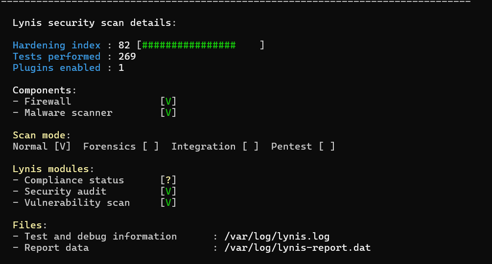

This final hardening level represents the system’s intended steady-state security posture and serves as the baseline for subsequent backup, restore, and monitoring phases of the project.

4.9 Limitations

No exploit-based attacks were performed.

No denial-of-service testing was conducted.

The assessment represents a post-hardening verification snapshot of the system
following applied security controls.

Testing was limited to non-intrusive techniques to validate hardening effectiveness
without impacting system availability.