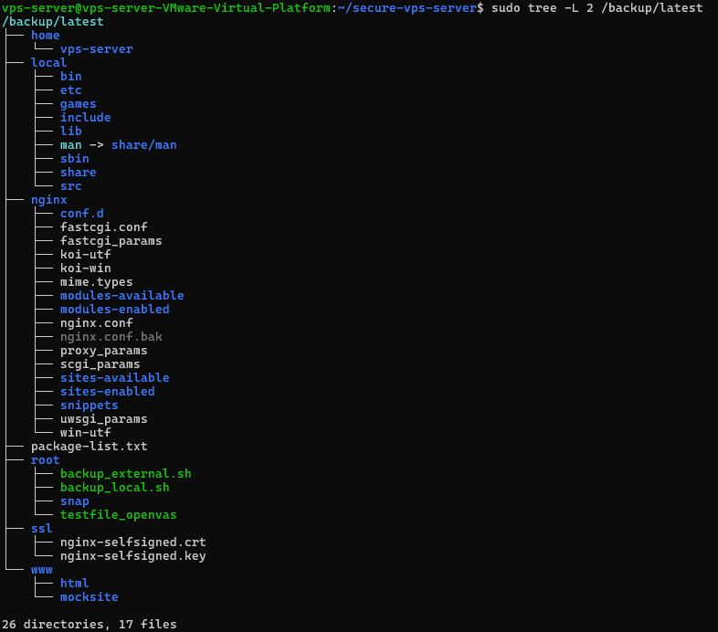
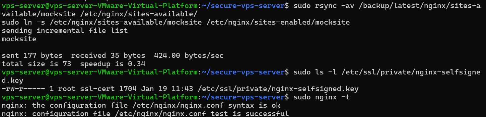
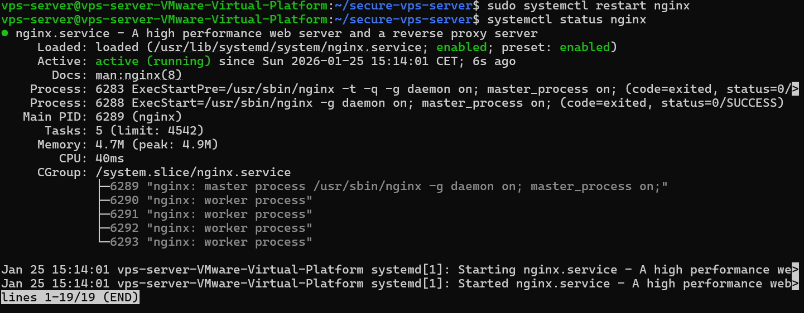
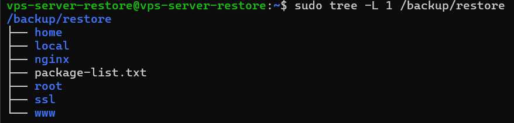
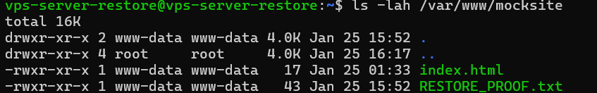
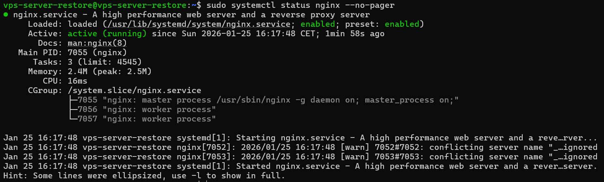

Backup Strategy and Configuration Preservation
Overview

The backup phase of this project builds directly upon the scripted hardening foundation established in the previous phase. The goal of the backup strategy is not only to preserve application data, but to ensure that the entire system - including its hardened security posture - can be reliably reconstructed after failure, compromise, or reinstallation.

Rather than treating backups as a simple file-copy mechanism, the design focuses on recoverability, integrity, and repeatability. All data required to restore the system to a secure and operational state is explicitly identified, preserved, and verified.

The backup solution is intentionally simple and transparent, avoiding unnecessary complexity while reflecting production-appropriate practices for a public-facing Linux server.

This documentation reflects the backup and restore process as implemented at the time of writing. Directory paths, service names, and restore order may vary depending on environment and application stack.

Backup Architecture

The backup strategy consists of two complementary layers:

Local backups stored on the primary server for fast recovery and verification

External backups stored on a separate backup server for disaster recovery

This layered approach ensures availability even in the event of complete loss or compromise of the primary system.

Backups are initiated from the primary server using a push-based model. The backup server acts strictly as a passive storage endpoint and does not execute any backup logic itself.

Prerequisites and Manual Preparation (Required)

Before executing the backup scripts, a small number of manual configuration steps must be completed. These steps are intentionally not automated, as they are environment-specific and require deliberate administrative validation.

Backup Script Configuration

The backup script must be reviewed and adjusted prior to first execution.

Open the script:

nano scripts/backup/backup.sh

Verify and update the following variables:

REMOTE_HOST – IP address or hostname of the backup server

REMOTE_USER – dedicated backup user on the backup server

REMOTE_BASE – target directory on the backup server

Failure to configure these values correctly will result in failed external backups.

SSH Key Authentication

The primary server must authenticate to the backup server using SSH key-based authentication.

Required conditions:

A dedicated, non-privileged backup user exists on the backup server

SSH key-based authentication is configured for this user

Password-based SSH authentication is disabled after key deployment

The backup server must not initiate connections or run backup scripts. All transfers are initiated from the primary system.

Directory Structure Validation

The following directories must exist on the primary server:

/backup/
/backup/daily/

On the backup server, the following directory must exist and be owned by the backup user:

/backup/vps-server/

Backup Scope Definition

Prior to implementation, the filesystem was reviewed to identify directories containing persistent, security-relevant, and operationally critical data.

The goal is to preserve all data required to reconstruct the system with the same security posture, while excluding runtime-generated or ephemeral data that should not be restored from backup.

Included Data

The following data is included in the backup scope:

/etc/nginx – web server configuration

/etc/ssl/private – private key material (including self-signed certificates)

/etc/letsencrypt – certificate data (if applicable)

/home – user data and SSH configuration

/root – administrative scripts and root-specific configuration

/var/www – web server content

/usr/local – locally installed scripts and administrative tools

package-list.txt – inventory of installed packages used for system rebuild

Only certificate material actively referenced by services is included. System-wide certificate trust stores are intentionally excluded.

Excluded Locations

Dynamic and temporary filesystems are deliberately excluded:

/proc

/sys

/dev

/run

/tmp

/var/cache

These locations are regenerated at runtime and restoring them would provide no benefit while potentially introducing inconsistencies.

Package Inventory Preservation

To support accurate system reconstruction, a complete inventory of installed packages is generated using the system package manager.

The package list is stored as a dedicated backup artifact and included in every backup snapshot. This enables a controlled rebuild process in which all required services and security tools can be reinstalled prior to configuration restoration.

Preserving the package inventory ensures that restored configuration files are applied to a compatible system baseline, preventing configuration drift and service misalignment.

Local Backup Implementation

Local backups are performed on the primary server using a dedicated backup script executed with root privileges.

Each backup execution creates a date-based snapshot under:

/backup/daily/YYYY-MM-DD

A symbolic link named latest is maintained and always points to the most recent backup. This simplifies restore operations, verification, and external replication.

File ownership, permissions, ACLs, and extended attributes are preserved to ensure that restored systems behave identically to the original environment.

Backup Retention Policy

A fixed retention policy is implemented to balance recovery capability and storage usage.

Backups are retained for 7 days

Backups older than the retention period are automatically removed

Retention is enforced during each backup execution

This approach ensures predictable storage usage while maintaining sufficient historical coverage for recovery and troubleshooting.

External Backup Architecture

To protect against complete loss of the primary system, backups are replicated to a separate backup server.

Backups are transferred using rsync over SSH in a push-based model, where the primary server initiates the transfer. This design simplifies firewalling and avoids the need for the backup server to access the primary system directly.

On the backup server, backups are stored under:

/backup/vps-server/

Each date-based backup directory is preserved exactly as received from the primary server.

Ownership of the backup data is assigned to a dedicated backup user, ensuring that the primary server does not retain administrative control over externally stored backups.

Dedicated Backup User

To enforce separation of duties and reduce the potential impact of credential compromise, a dedicated non-privileged user is used for all backup operations on the backup server.

Key properties of this user:

No administrative privileges

Filesystem access restricted to the backup directory

SSH key-based authentication only

No interactive operational role beyond backup storage

This design ensures that:

Compromise of the primary server does not grant administrative access to the backup server

Backup data cannot be modified outside the designated storage location

The backup server maintains a minimal attack surface

This approach aligns with least-privilege principles and common production practices.

Backup Automation

Backup execution is fully automated using cron jobs running as root on the primary server.

The following schedule is used:

02:00 – Local backup execution

02:30 – External backup replication

This sequencing ensures that the external backup always reflects a complete and verified local backup.

Backup activity is logged, and cron execution is verifiable through system logs.

Backup execution can be verified via /var/log/syslog entries generated by cron.

Backup Verification

Backup correctness was verified through multiple validation steps:

Inspection of local backup directory structure

Verification of the latest symbolic link

Comparison of local and external backup contents

Verification of file ownership and permissions on the backup server

Review of backup execution logs

Confirmation of cron execution via system logs

These checks confirm that backups are created consistently, transferred securely, and stored in a recoverable format.

Backup Strategy and Configuration Preservation

The backup phase explicitly includes preservation of the security baseline itself.

All system hardening scripts and configuration files are maintained in a version-controlled repository. This repository serves as the definitive source of truth for the system’s intended security state.

Backups therefore consist of three distinct components:

System and application data

System configuration state

Security baseline and hardening scripts

This ensures that security is not reconstructed manually after failure. Instead, the full hardening baseline can be reapplied automatically from a trusted source.

By documenting all applied hardening measures and maintaining them as code, the backup process also functions as security documentation. This enables rapid recovery while maintaining a consistent and verifiable security posture.

Transition to Restore Phase

This phase focused exclusively on backup design, implementation, and verification.

Restore procedures are intentionally documented and tested as a separate phase to avoid coupling backup validation with recovery assumptions.

The following restore phase demonstrates how the backed-up data and scripted security baseline are used to reconstruct a system from a clean installation and verify that the original hardened state is successfully restored.

------------------------------------------------------

Restore Validation – Local and Disaster Recovery

The restore phase validates that the backup strategy is not only theoretically correct, but practically usable to recover system functionality and security posture after data loss or system rebuild.

Restoration is intentionally performed using documented, explicit commands rather than a fully automated restore script. This approach reduces the risk of accidental data overwrites and ensures operator awareness during destructive recovery operations.

Local Restore Validation (File-Level Recovery)
Purpose

The purpose of this test is to verify that individual components can be restored from backup without impacting unrelated system state.

This scenario simulates accidental deletion or corruption of production data while the system remains operational.

Pre-Restore Verification

Before performing any destructive action, the presence of valid backups was verified.

The following command confirms that a recent backup snapshot exists:

sudo tree -L 2 /backup/latest

This confirms that all required backup components are available prior to restoration.

Simulated Data Loss

To simulate accidental deletion, the web application directory and Nginx site configuration were removed:

sudo rm -rf /var/www/mocksite
sudo rm -f /etc/nginx/sites-available/mocksite
sudo rm -f /etc/nginx/sites-enabled/mocksite

Verification confirms that the data is no longer present.

Restore Procedure

The following steps were used to restore the deleted components from backup.

Restore Web Content
sudo rsync -av /backup/latest/www/mocksite /var/www/
sudo chown -R www-data:www-data /var/www/mocksite
sudo chmod -R 755 /var/www/mocksite

Restore Nginx Configuration
sudo rsync -av /backup/latest/nginx/sites-available/mocksite /etc/nginx/sites-available/
sudo ln -s /etc/nginx/sites-available/mocksite /etc/nginx/sites-enabled/mocksite

Verify TLS Material

The self-signed certificate and private key were verified to exist with correct permissions:

sudo ls -l /etc/ssl/private/nginx-selfsigned.key

Service Validation

Before restarting services, configuration syntax was verified:

sudo nginx -t

The service was then restarted:

sudo systemctl restart nginx

Final verification confirms that the service is running correctly:

systemctl status nginx

Result

The deleted application and configuration were successfully restored from backup without requiring system reboot or reinstallation.

This confirms that:

Backups contain all required data

Restore operations are predictable and repeatable

Service functionality is preserved after recovery

Disaster Recovery Restore (Planned)

A full disaster recovery restore is planned as the next phase of the project.

This scenario will simulate complete system loss by restoring data and security configuration onto a freshly installed virtual machine.

The DR restore will validate that:

The system can be rebuilt from scratch

Security hardening can be reapplied via scripted configuration

Backup data is sufficient to restore application functionality

Security posture is consistent after rebuild

Design Decision: Why Restore Is Not Fully Automated

Restore procedures are intentionally documented rather than fully automated.

This decision reflects real-world operational practices, where restoration:

Is destructive by nature

Requires operator validation at each step

Must be adapted to environment-specific conditions

All required commands are explicitly documented to ensure restore operations remain auditable, repeatable, and safe.

While local restore validates file-level recovery, disaster recovery validates full system rebuild capability.

Disaster Recovery Restore - Full Documentation

Disaster Recovery Restore Overview

This phase demonstrates a full disaster recovery (DR) restore on a clean, newly deployed virtual machine.
The objective is to verify that the system can be reconstructed using only external backups, without relying on the original server.

The restore process validates:

Backup completeness

Restore repeatability

Correct handling of permissions and ownership

Operational recovery of a production-like web service

No automation is used for the restore phase. All actions are performed manually by design to ensure transparency, auditability, and administrator control.

Restore Preconditions

Before starting the restore, the following conditions must be met:

A fresh Linux server installation is available

Network connectivity to the backup server is confirmed

A dedicated backup user exists on the backup server

SSH access to the backup server is functional

The external backup directory exists on the backup server

Restore Directory Structure

On the restore server, a temporary restore directory is created:

sudo mkdir -p /backup/restore

This directory is used as a staging area to avoid directly restoring data into system paths before verification.

Phase 1 – Retrieve Backup from Backup Server

The backup is pulled from the backup server using rsync over SSH.

sudo rsync -av backupuser@<BACKUP_SERVER_IP>:/backup/vps-server/YYYY-MM-DD/ /backup/restore/

Verification:

sudo tree -L 3 /backup/restore

Expected content:

www/mocksite

nginx/sites-available/mocksite

ssl/nginx-selfsigned.crt

ssl/nginx-selfsigned.key

package-list.txt

Phase 2 – Restore Web Content
sudo rsync -av /backup/restore/www/mocksite /var/www/
sudo chown -R www-data:www-data /var/www/mocksite
sudo chmod -R 755 /var/www/mocksite

Verification:

ls -lah /var/www/mocksite

Phase 3 – Restore Nginx Configuration
sudo rsync -av /backup/restore/nginx/sites-available/mocksite /etc/nginx/sites-available/
sudo ln -s /etc/nginx/sites-available/mocksite /etc/nginx/sites-enabled/mocksite

This restores the virtual host configuration and enables the site.

Phase 4 – Restore TLS Certificates (Self-Signed)
sudo mkdir -p /etc/ssl/certs /etc/ssl/private

sudo rsync -av /backup/restore/ssl/nginx-selfsigned.crt /etc/ssl/certs/
sudo rsync -av /backup/restore/ssl/nginx-selfsigned.key /etc/ssl/private/

sudo chown root:ssl-cert /etc/ssl/private/nginx-selfsigned.key
sudo chmod 640 /etc/ssl/private/nginx-selfsigned.key
sudo chmod 710 /etc/ssl/private
sudo usermod -aG ssl-cert www-data

Only service-specific certificate material is restored.
System trust stores are intentionally excluded.

Phase 5 – Service Validation and Startup
sudo nginx -t
sudo systemctl restart nginx
sudo systemctl status nginx --no-pager

Successful output confirms that the web service is operational.

Restore Validation Result

The disaster recovery restore was completed successfully:

Web content restored

Nginx configuration restored

TLS certificates restored

Correct permissions applied

Service started without errors

This confirms that the system can be rebuilt from external backups alone.

Conclusion

The disaster recovery process demonstrates that:

Backups are complete and usable

Restore procedures are repeatable

Security posture is preserved

Recovery does not depend on the original system

The environment is recoverable in a controlled and auditable manner, meeting production-grade disaster recovery expectations.