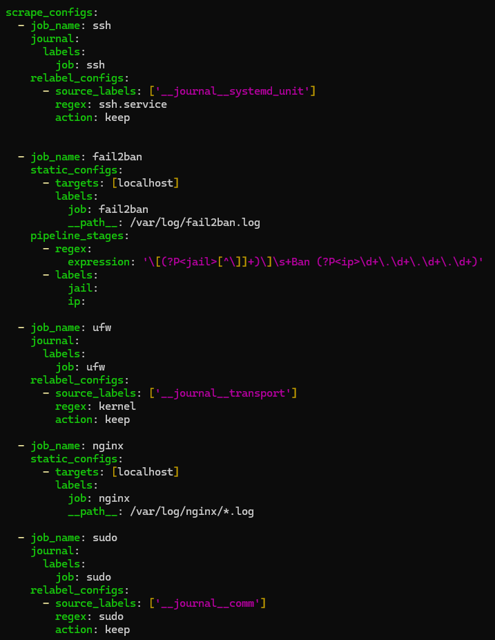
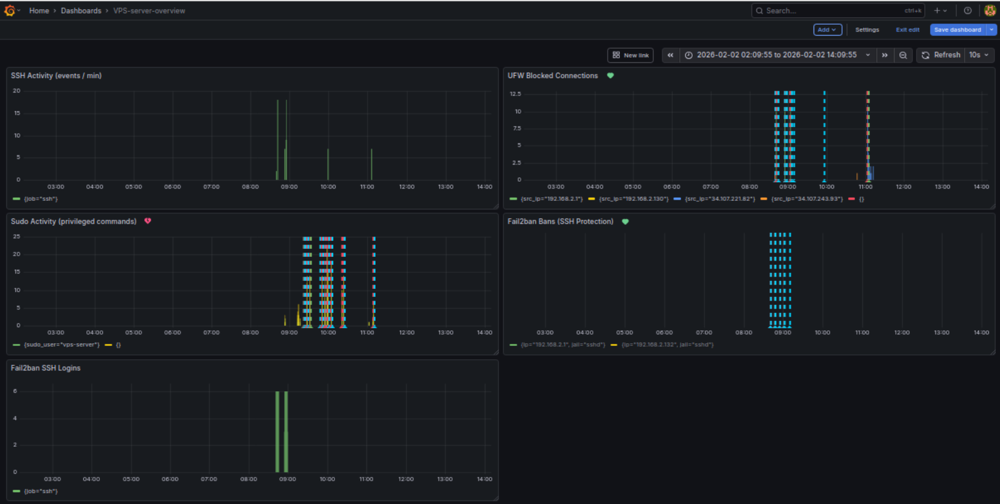
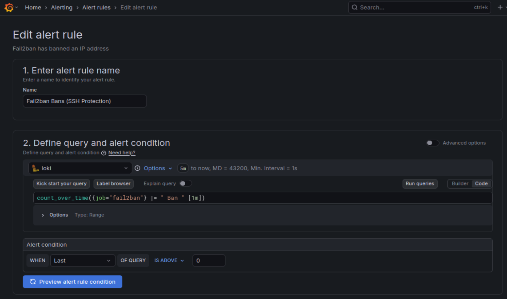
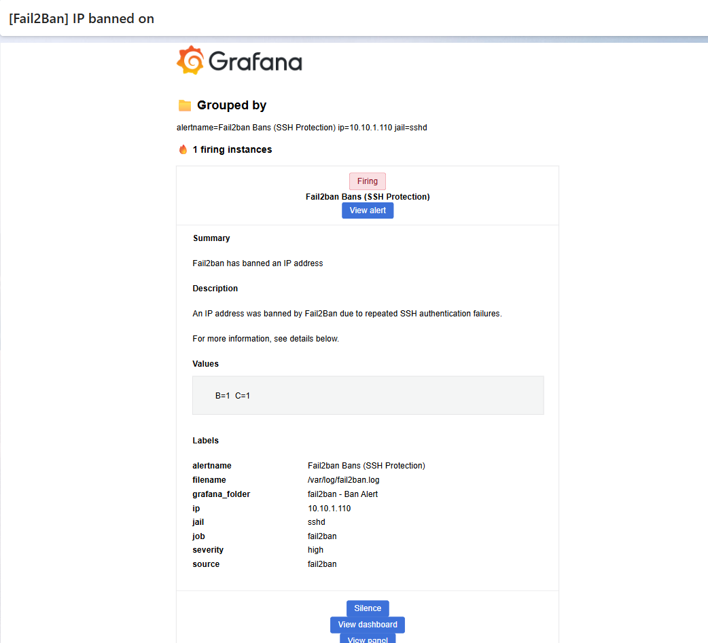
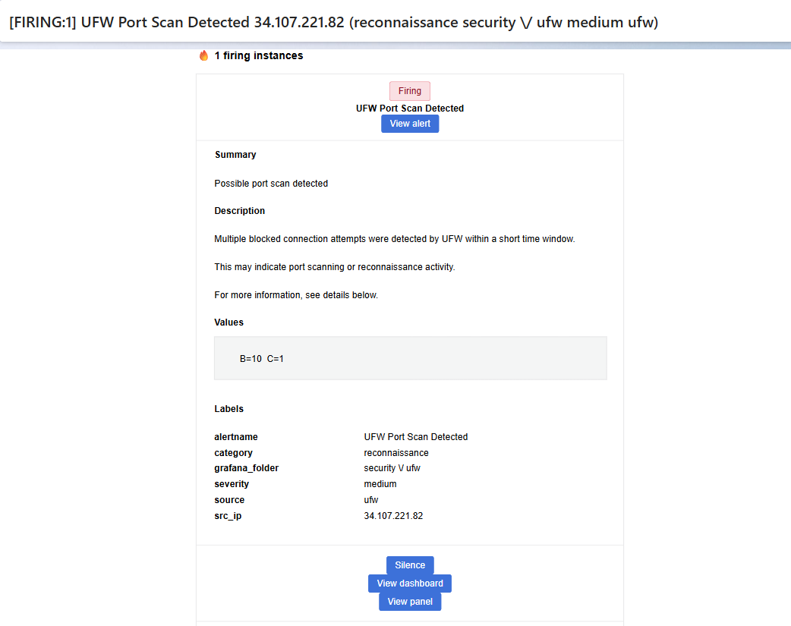
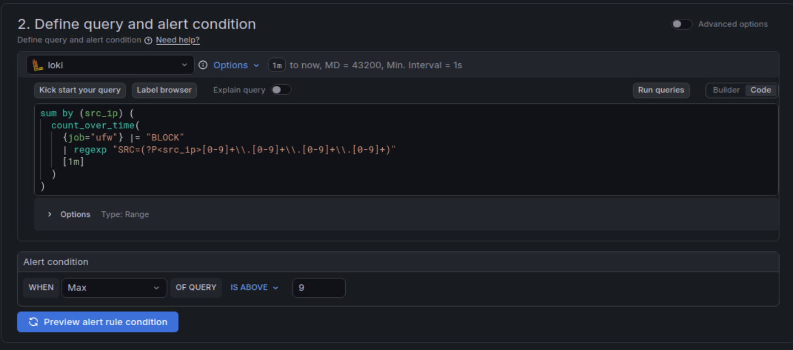
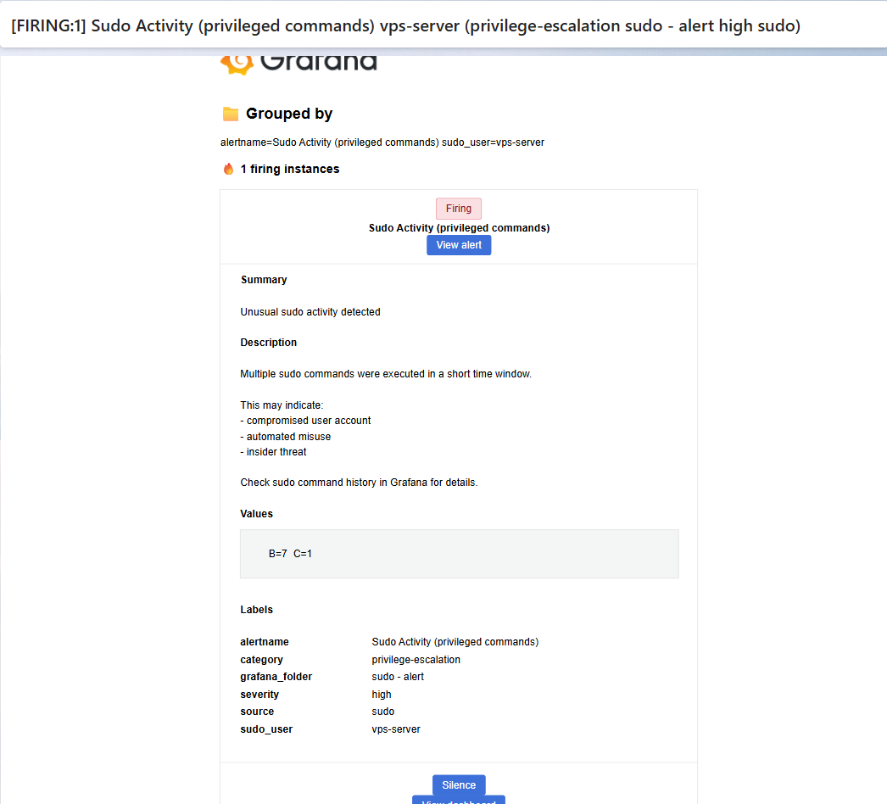
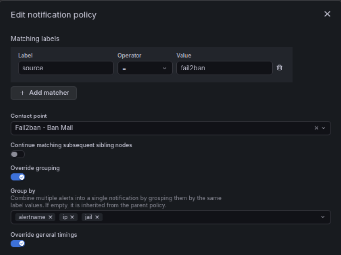
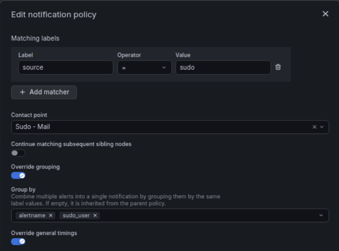

Logging & Monitoring - Log-Based Security Monitoring with Grafana and Loki

Objective

The objective of this phase was to design and implement practical log-based security monitoring for an internet-exposed VPS server.

The focus was on detecting real security-relevant events, not synthetic metrics, with emphasis on:

- External threats (brute force, port scanning, reconnaissance)

- Internal threats (sudo / privilege escalation)

- Actionable email alerts

- Low false-positive rate

- Full visibility through Grafana dashboards

This phase serves as the detection and notification foundation for subsequent IDS/IPS and SOAR automation stages.

```text
Architecture Overview

🔹 Log Collection Flow
System Logs / Journald
        ↓
     Promtail
        ↓ (HTTP push)
/loki/api/v1/push
        ↓
       Loki
        ↓
     Grafana
```

Promtail collects logs from the host and pushes them to Loki

Loki stores and indexes logs and exposes a query API

Grafana queries Loki for visualization and alerting

Loki does not read log files directly. All log sources are defined in Promtail.


Log Sources

The following security-relevant log sources were collected:

Source	Purpose
fail2ban.log	Confirmed SSH brute force attacks
journald	UFW Network scanning / reconnaissance
journald	Sudo / privilege escalation activity
journald	SSH authentication events




NGINX logs are collected but not actively alerted on during this phase. They are intentionally reserved for later IDS/IPS and SOAR correlation, particularly during the OWASP Juice Shop attack simulations.

Dashboards

Multiple dashboards were created to provide clear separation of concerns and fast situational awareness:

VPS Server Overview

Security / Fail2Ban

Security / UFW

Sudo Activity

Dashboards focus on:

Event frequency

Spikes and anomalies

Correlation between sources




1. Fail2Ban – SSH Brute Force Detection

Purpose

Detect confirmed SSH brute force attacks where Fail2Ban has actively banned an IP.

Log Source

/var/log/fail2ban.log

Only ban events are considered (noise excluded)

Detection Logic

Count ban events per IP

Group alerts per IP and jail

🚨 Alert Behavior

Alert triggers immediately on new ban

One alert per IP

Old bans do not retrigger alerts

📧 Result

Email includes:

IP address

Jail name (e.g. sshd)

Timestamp

Result: Reliable brute force detection without alert spam




2. UFW – Port Scanning / Reconnaissance Detection

Purpose

Detect network scanning and reconnaissance attempts against the VPS.

This represents:

External attack surface

Pre-exploitation activity

Relevant signal before pentesting / Juice Shop scenarios

📄 Log Example
[UFW BLOCK] IN=ens33 SRC=192.168.2.1 DPT=22
[UFW BLOCK] IN=ens33 SRC=192.168.2.1 DPT=80
[UFW BLOCK] IN=ens33 SRC=192.168.2.1 DPT=443

🔎 Loki Query

Source IP is extracted directly from log content:

sum by (src_ip) (
  count_over_time(
    {job="ufw"} |= "BLOCK"
    | regexp "SRC=(?P<src_ip>[0-9]+\\.[0-9]+\\.[0-9]+\\.[0-9]+)"
    [1m]
  )
)


Source IP is not available as a label by default

Extraction enables per-IP correlation

Enables accurate port scan detection


🚨 Alert Logic

Threshold: e.g. >9 blocks per minute

Triggers only during fast scanning, not normal traffic

📧 Email includes:

Source IP

Severity

Detection context

Screenshot below is from a real scan from external unknown user 






3. Sudo – Privilege Escalation Detection

Purpose

Detect abnormal sudo usage indicating:

Compromised user

Insider threat

Post-auth exploitation

Lateral movement

Log Example

sudo: vps-server : COMMAND=/usr/bin/apt update


Filter out sudo entries without invoking user.
Final Query

sum by (sudo_user) (
  count_over_time(
    {job="sudo"}
    | regexp "by (?P<sudo_user>[a-zA-Z0-9_-]+)\\(uid="
    [1m]
  )
)

Effect

Only real privilege escalations counted

No PAM noise

One alert per user



📬 Notification Policies & Routing

Separate contact points were configured:

Fail2Ban → Fail2Ban Mail

UFW → UFW Mail

Sudo → Sudo Mail

Routing is based on labels:

source=fail2ban

source=ufw

source=sudo

Grouping keys:

Fail2Ban: alertname + ip

UFW: alertname + src_ip

Sudo: alertname + sudo_user







Alert Lifecycle Handling

Handled and tuned:

Alert state transitions

Keep-firing behavior

No-data and error handling

Event-based alerting vs incident-based alerting

Result:

No delayed alerts

No duplicate emails

Stable and predictable alert behavior

 Final Outcome

- Centralized log-based security monitoring
- SSH brute force detection
- Port scanning / reconnaissance detection
- Privilege escalation detection
- Clear dashboards
- Actionable, non-spammy alerts
- SOC-oriented design
- Strong foundation for IDS/IPS and SOAR

Summary

This phase delivers realistic, production-inspired logging and monitoring, focusing on:

Correct signal extraction

Noise reduction

Proper alert lifecycle management

Clear separation between detection and response

The implemented solution is practical, interview-ready, and serves as a solid base for IDS/IPS integration and SOAR automation in the next phase.