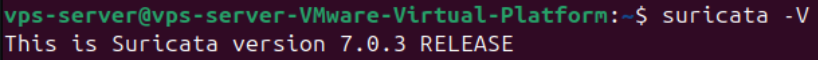
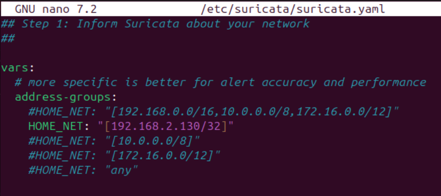
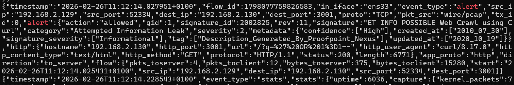
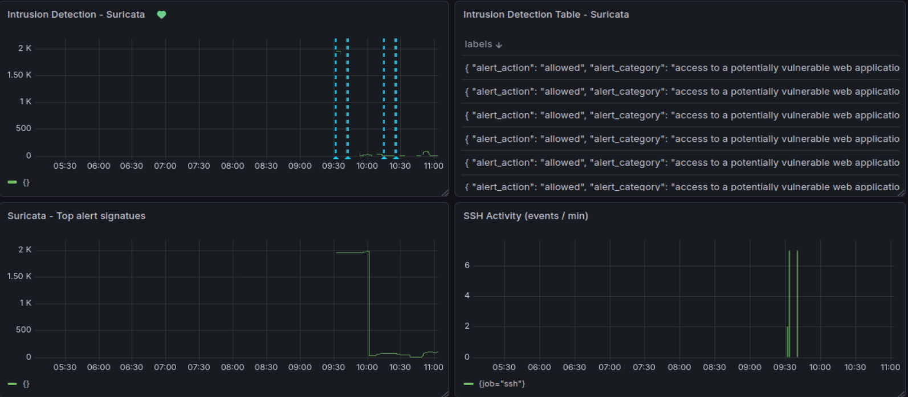
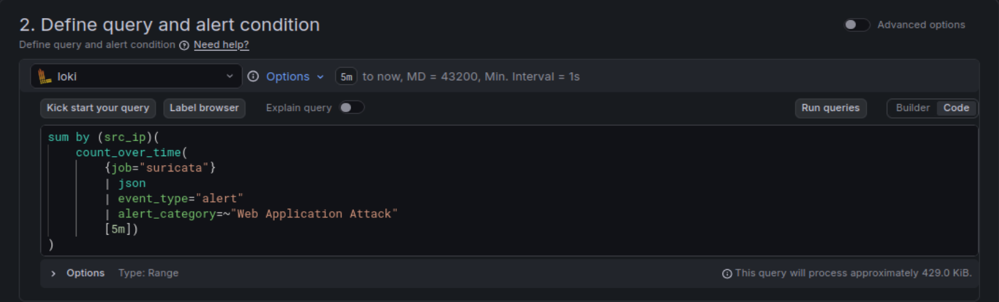
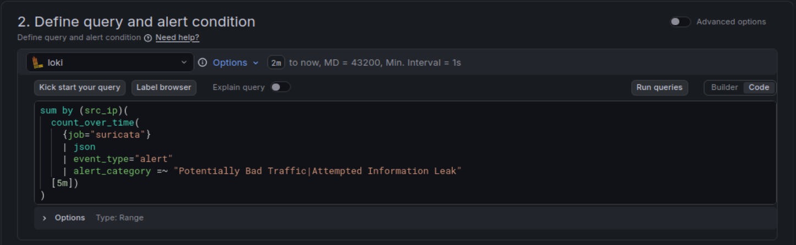
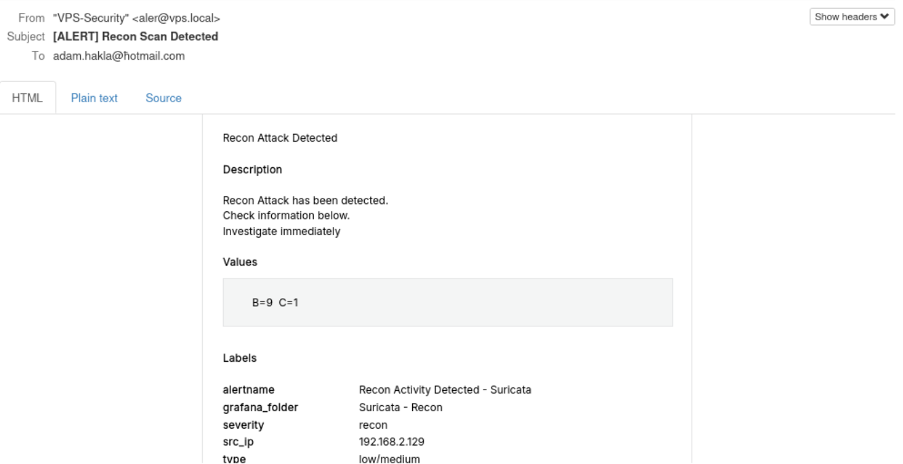
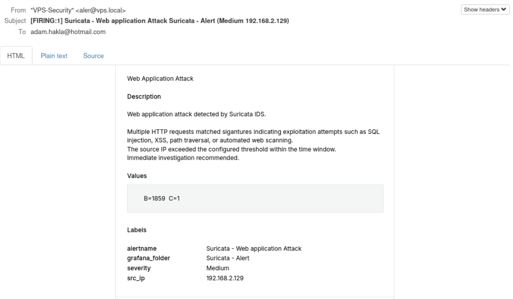

7. IDS / IPS Deployment (Detection Phase)

A system snapshot was taken prior to IDS implementation to preserve a stable and reproducible monitoring baseline following logging and monitoring configuration.


7.1 Purpose of the IDS / IPS Phase

The purpose of this phase is to extend the hardened baseline into active intrusion detection and monitoring.

While previous phases focused on:

Attack surface reduction

Secure configuration

Host-based protection (UFW, Fail2Ban)

Logging and observability

This phase introduces:

Network-based intrusion detection

Deep packet inspection

Web attack detection

Structured alert classification

Detection validation using controlled attack simulation

The objective is not exploit development, but validation of detection capability within a controlled environment.


7.2 Architectural Transition - From UFW Logging to Suricata IDS

During earlier phases, detection relied primarily on:

UFW firewall logs

Fail2Ban SSH brute-force protection

These mechanisms provided host-based visibility and reactive blocking but were limited to:

Port-level activity

Authentication events

Firewall rule hits

They did not provide:

Application-layer inspection

Signature-based web attack detection

Categorized intrusion classification

To address these limitations, Suricata was implemented as a network-based IDS.

This represents a shift from basic firewall logging to structured intrusion detection.


7.3 Suricata Deployment

Tool Used
Suricata

Purpose
To implement signature-based network intrusion detection with application-layer inspection.

Suricata was installed and configured in IDS mode.

Verification:




Suricata version verification


7.4 HOME_NET Configuration

To ensure correct traffic classification, the HOME_NET variable was configured to reflect the VPS internal IP address.

HOME_NET: "[192.168.2.130/32]"

This ensures:

The server is treated as protected network space

Incoming traffic is analyzed correctly

Alerts are contextualized relative to the protected asset

Screenshot




7.5 Structured Logging - eve.json

Suricata was configured to output structured JSON logs to:

/var/log/suricata/eve.json

Validation:

sudo tail -f /var/log/suricata/eve.json

This structured format enables:

Field-level parsing

Alert categorization

Integration with Loki and Grafana




7.6 Integration with Loki and Grafana

Suricata logs were ingested via Promtail into Loki and visualized in Grafana.

New dashboard panels were created for:

Total Suricata alerts

Alerts grouped by category

Alerts grouped by source IP

Recon vs Web exploitation separation

This extends the logging and monitoring phase into actionable intrusion detection.




7.7 Alert Design and Classification Strategy

To reduce alert fatigue and prepare for IPS automation, alerts were separated into two logical categories:

Reconnaissance Alert

Filters:

Potentially Bad Traffic

Attempted Information Leak

Covers:

Nmap scanning

Nikto scanning

Enumeration activity

Web Application Attack Alert

Filters:

Web Application Attack

Attempted Privilege Gain

Covers:

Cross-Site Scripting attempts

Web exploitation signatures

This separation ensures that scanning activity does not trigger the same response logic as exploitation attempts.


7.8 Threshold-Based Alerting
``` text
Alerts were implemented using:

sum by (src_ip)(
  count_over_time(
    {job="suricata"}
    | json
    | event_type="alert"
    | alert_category="Attempted.*Privilege Gain|Web Application Attack"
  [5m])
)
```

Design Decisions:

Grouping by src_ip ensures per-attacker evaluation

Threshold-based logic prevents single-request false positives

Architecture prepares for automated IP blocking in next phase

The first picture is of the Web application attack, and the second one is for the Recon alert






Screenshot

Grafana alert rule configuration


7.9 Controlled Attack Simulation - Recon Testing

Tool Used
Nmap

Command Used

nmap -sS <target-ip>

Observed Behavior:

Suricata classified activity as reconnaissance

Alert category: Attempted Information Leak / Potentially Bad Traffic

Recon alert triggered correctly

Mail notification confirmed




7.10 Controlled Attack Simulation - Web Exploitation (XSS)

To validate application-layer inspection, an XSS payload was submitted:

curl "http://<target-ip>:3001/?q=<script>alert(1)</script>"

Observed Result in eve.json:

Signature:
ET WEB_SERVER Script tag in URI Possible Cross Site Scripting Attempt

Category:
Web Application Attack

Severity:
1

The Web Application Alert triggered as expected.

This confirms that:

Suricata performs deep packet inspection

Application-layer payloads are inspected

Signature-based detection is operational

Mail notification




7.11 Design Decisions and Limitations

The IDS was deployed in detection mode only.

Automatic blocking was intentionally deferred to the next phase (SOAR-like automation).

This separation ensures:

Clear architectural boundaries

Observable detection before enforcement

Controlled validation prior to automated response

The system now provides:

Network-based intrusion visibility

Categorized alert classification

Source IP attribution

Threshold-controlled detection

Dashboard monitoring

Email notification


7.12 Summary

This phase extends the security architecture from prevention-only controls to active intrusion detection.

Compared to earlier phases:

Baseline:
No monitoring

Hardening Phase:
Firewall + Fail2Ban

Monitoring Phase:
Centralized logging

IDS Phase:
Network-based intrusion detection
Application-layer inspection
Structured alert classification

The system is now capable of detecting:

Port scanning

Enumeration attempts

Web exploitation signatures

Suspicious HTTP payloads

This detection layer forms the foundation for the next phase:

Automated response and IPS-style blocking.