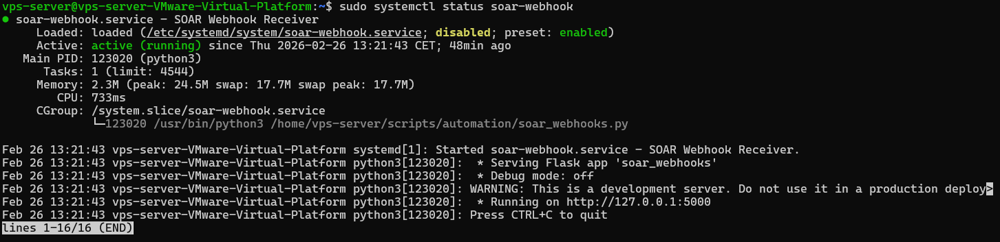
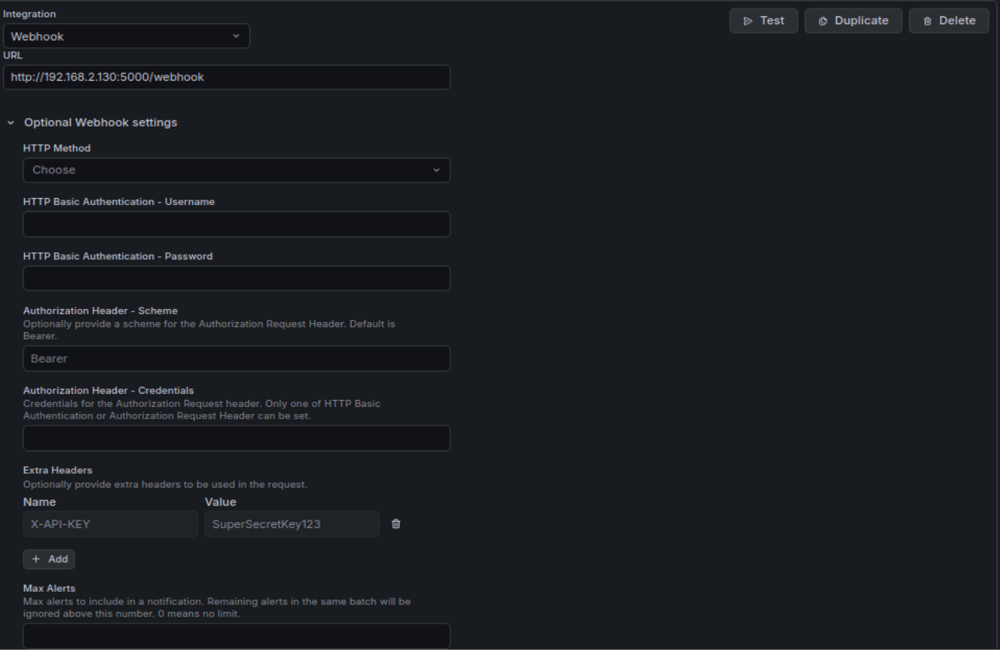
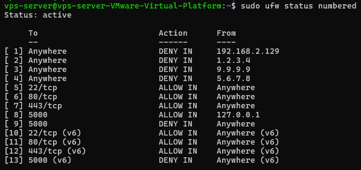
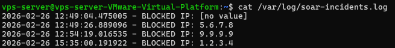
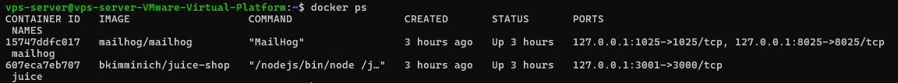
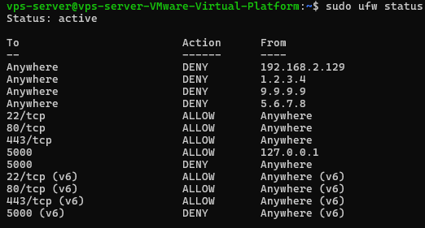
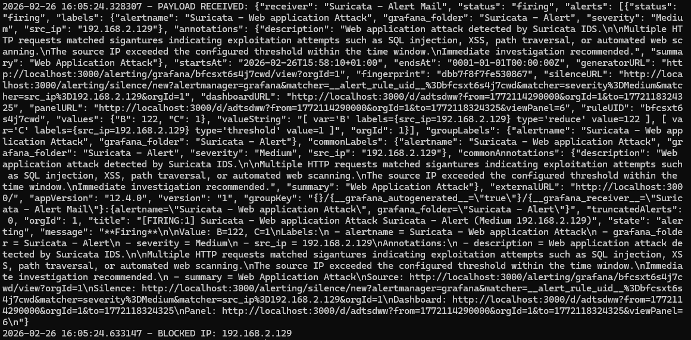
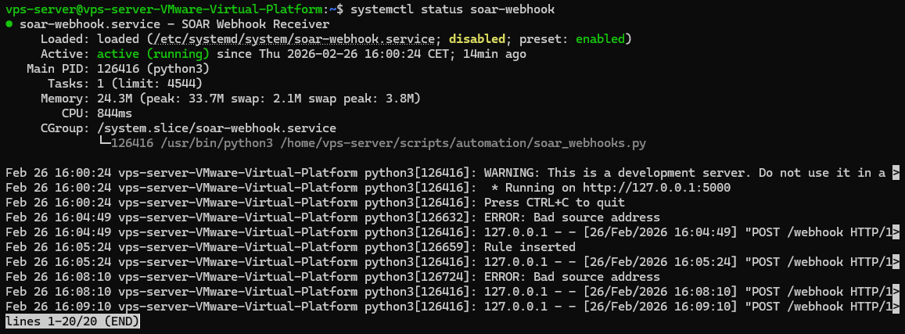

8. SOAR Automation – Automated Response and Perimeter Hardening

8.1 Purpose of the SOAR Phase

The purpose of this phase is to extend the existing IDS-based detection architecture into automated response.

While previous phases implemented:

Intrusion detection (Suricata)

Alert correlation and threshold logic (Grafana)

Email-based notification

This phase introduces:

Event-driven automation

Dynamic firewall enforcement

Secure webhook-based alert ingestion

Perimeter service isolation via reverse proxy

The objective is to transition from passive detection to controlled automated response while maintaining architectural separation between detection, decision, and enforcement.


8.2 Architectural Overview

The SOAR implementation follows a layered architecture:

``` text
Attack
↓
Suricata IDS
↓
Grafana Alert Rule (Threshold-based)
↓
Webhook (Python SOAR Service)
↓
UFW Firewall Block
↓
Incident Log

```

Key design principles:

Detection logic remains in Grafana

Automation does not re-evaluate thresholds

Firewall acts as enforcement layer

Webhook is protected and not publicly exposed

All services are routed through a TLS-terminated reverse proxy

8.3 Webhook-Based Automation Service

A Python-based webhook receiver was implemented using Flask.

The service:

Listens on localhost only (127.0.0.1:5000)

Requires API key authentication

Extracts source IP from Grafana alert payload

Inserts deny rule into UFW

Logs incident to /var/log/soar-incidents.log

The webhook service runs as a systemd service to ensure:

Automatic startup on boot

Process supervision

Operational persistence





8.4 API Key Protection

The webhook endpoint is protected using a custom HTTP header:

X-API-KEY

If the key is invalid, the request is rejected with HTTP 403.

This ensures:

Only Grafana can trigger automation

External actors cannot block arbitrary IP addresses

Automation is protected even if port-level controls fail




8.5 Dynamic Firewall Enforcement (UFW Integration)

When an alert threshold is triggered:

The webhook extracts src_ip

A deny rule is inserted at the top of UFW

Example resulting firewall state:

Anywhere DENY IN 9.9.9.9
Anywhere DENY IN 5.6.7.8

These rules:

Are persistent across reboots

Take priority over other rules

Represent the automated blocklist




Each automated block event is logged to:

/var/log/soar-incidents.log

Example entry:

826-02-26 13:40:22 - BLOCKED IP: 9.9.9.9

This provides:

Traceability

Auditability

Forensic visibility





8.7 Reverse Proxy Perimeter Design

To enforce proper perimeter architecture:

All internal services were bound to localhost:

Service	Internal Bind
Juice Shop	127.0.0.1:3001
MailHog	127.0.0.1:8025
Grafana	127.0.0.1:3000
SOAR Webhook	127.0.0.1:5000

Nginx acts as the single public ingress point on port 443.

All public traffic flows:

Internet → Nginx (443) → Internal Service

This ensures:

No management ports are publicly exposed

TLS termination is centralized

Service segmentation is enforced

Internal services cannot be reached directly




8.8 Firewall Perimeter State

Final UFW configuration exposes only:

22 (restricted)

80 (redirect or optional)

443 (public ingress)

5000 (localhost only)




This demonstrates:

Single ingress architecture

Protected automation endpoint

Dynamic IPS-style blocking


8.9 Verification and Validation

To validate the SOAR automation pipeline, a controlled XSS attack was executed against the vulnerable application (OWASP Juice Shop).

The following sequence was observed:

Suricata generated detection events.

Grafana alert transitioned to FIRING state.

Webhook transmitted alert payload to localhost endpoint.

SOAR service extracted source IP.

UFW dynamically inserted deny rule.

Attacker host lost connectivity to the server.

This confirms:

End-to-end automation

Firewall-level enforcement

Persistence of block rule

Secure webhook ingestion







8.10 Security Design Decisions

Key design decisions:

Threshold logic remains in Grafana (not duplicated in automation)

Firewall rules are persistent and stateful

Webhook is API-authenticated

Webhook is not publicly exposed

Services bind to localhost only

Reverse proxy centralizes ingress

No double-alerting mechanism implemented (intentional design choice)

This avoids:

Alert duplication

Logic duplication

Over-engineering

Increased attack surface


8.11 Outcome

The system now provides:

Network-based intrusion detection

Threshold-based attack classification

Automated firewall enforcement

Persistent IP blocklisting

Secure webhook ingestion

Centralized TLS reverse proxy

Internal service isolation

Incident logging

This completes the transition from detection-only architecture to controlled automated response.